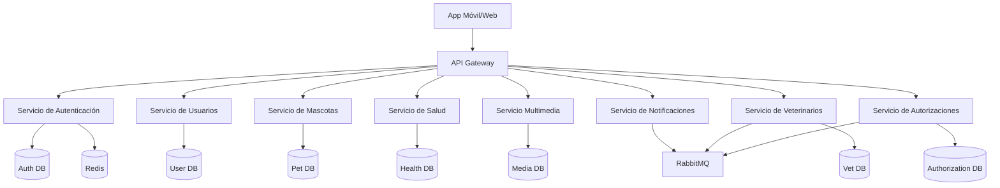

# 🐾 Libreta Sanitaria de Mascotas

Plataforma para gestionar la historia clínica de tus mascotas, incluyendo vacunas, historial médico y más. Construida con una arquitectura de microservicios y una aplicación móvil multiplataforma.

## 🏗 Arquitectura

El sistema está armado con una arquitectura de microservicios para asegurar que escale y sea fácil de mantener.



## 🛠 Tech Stack (Tecnologías)

- **Backend:** NestJS, TypeScript
- **Frontend:** React Native (Expo), NativeWind, Zustand
- **Bases de Datos:** PostgreSQL, Redis
- **Message Broker:** RabbitMQ
- **Infraestructura:** Docker, Docker Compose

## Estado actual (veterinarios y autorizaciones)
- Servicios `veterinarian` (3007) y `authorization` (3011) ya están en Docker Compose con colas RMQ y .env revisados (DBs expuestas en 5438/5439).
- Gateway expone controladores de veterinarios y autorizaciones y propaga `role`/`veterinarianId` en JWT; el guard de permisos vet↔mascota cubre creación/actualización y lecturas puntuales, pero faltan listados, pruebas y metadatos de licencia/clinicName en Health.
- Certificaciones de veterinario: se valida `mediaId` (UUID) y archivos pdf/png/jpg/jpeg ≤5MB; integración completa con Media y migraciones definitivas siguen pendientes.
- Frontend: rol veterinarian via authStore, dashboard/perfil/búsqueda de vet y autorizaciones con toasts; QR personal y scanner listos. Pendiente QA/paginación real en pacientes/autorizaciones vet y Google Sign-In con rol.

## 🚀 Cómo arrancar

### Lo que necesitás

- [Docker](https://www.docker.com/) & Docker Compose
- [Node.js](https://nodejs.org/) (v20+ recomendado)

### Instalación y Puesta en Marcha

El proyecto usa un `Makefile` para facilitarte la vida con las operaciones comunes.

1. **Cloná el repositorio:**
   ```bash
   git clone <url-del-repositorio>
   cd libreta-sanitaria-mascotas
   ```

2. **Levantá todos los servicios:**
   ```bash
   cd infra
   make up
   ```
   Este comando te levanta todos los microservicios y las bases de datos usando Docker Compose.

3. **Corré la App Móvil:**
   Abrí una terminal nueva y mandale:
   ```bash
   cd app
   npm install
   npm start
   ```

### Swagger
- Gateway expone la documentación en `http://localhost:3000/api/docs` (Authorizations, Veterinarians, Pets, Health). Incluye parámetros `page/limit` en listados paginados.

### Comandos útiles (usando el Makefile en `infra/`)

- `make up`: Levanta todos los servicios en background.
- `make down`: Baja todos los servicios.
- `make down-volumes`: Baja los servicios y borra los volúmenes de las bases de datos (resetea la data).
- `make logs`: Mirá los logs de todos los servicios.
- `make ps`: Chequeá el estado de los contenedores.

## 📦 Resumen de Servicios

| Servicio | Puerto | Descripción |
|---------|------|-------------|
| **Gateway** | 3000 | Punto de entrada para la API. |
| **Auth** | 3001 | Autenticación y Autorización (JWT). |
| **User** | 3002 | Manejo de perfiles de usuario. |
| **Pet** | 3003 | Perfiles y datos de las mascotas. |
| **Health** | 3004 | Registros médicos, vacunas, etc. |
| **Media** | 3005 | Subida de archivos y manejo multimedia. |
| **Notification** | 3006 | Notificaciones push y alertas. |
| **Veterinarian** | 3007 | Perfiles y certificaciones de veterinarios, QR verificado. |
| **Authorization** | 3011 | Consentimientos y autorizaciones de acceso a historiales. |

## 📱 App Móvil

La aplicación móvil está hecha con Expo y corre en Android, iOS y Web.
- **Framework:** React Native / Expo
- **Estilos:** NativeWind (TailwindCSS)
- **Manejo de Estado:** Zustand

## 📄 Licencia

[MIT](LICENSE)
