# 🐾 Libreta Sanitaria de Mascotas

Plataforma para gestionar la historia clínica de tus mascotas, incluyendo vacunas, historial médico y más. Construida con una arquitectura de microservicios y una aplicación móvil multiplataforma.

## 🏗 Arquitectura

El sistema está armado con una arquitectura de microservicios para asegurar que escale y sea fácil de mantener.

```mermaid
graph TD
    Client[App Móvil/Web] --> Gateway[API Gateway]
    Gateway --> Auth[Servicio de Autenticación]
    Gateway --> User[Servicio de Usuarios]
    Gateway --> Pet[Servicio de Mascotas]
    Gateway --> Health[Servicio de Salud]
    Gateway --> Media[Servicio Multimedia]
    Gateway --> Notif[Servicio de Notificaciones]
    Gateway --> Vet[Servicio de Veterinarios]
    Gateway --> Authorization[Servicio de Autorizaciones]
    
    Auth --> AuthDB[(Auth DB)]
    Auth --> Redis[(Redis)]
    
    User --> UserDB[(User DB)]
    
    Pet --> PetDB[(Pet DB)]
    
    Health --> HealthDB[(Health DB)]
    
    Media --> MediaDB[(Media DB)]
    
    Vet --> VetDB[(Vet DB)]
    
    Authorization --> AuthorizationDB[(Authorization DB)]
    
    Notif --> RabbitMQ[RabbitMQ]
    Vet --> RabbitMQ
    Authorization --> RabbitMQ
```



## 🛠 Tech Stack (Tecnologías)

- **Backend:** NestJS, TypeScript
- **Frontend:** React Native (Expo), NativeWind, Zustand
- **Bases de Datos:** PostgreSQL, Redis
- **Message Broker:** RabbitMQ
- **Infraestructura:** Docker, Docker Compose

## 🚀 Cómo arrancar

### Lo que necesitás

- [Docker](https://www.docker.com/) & Docker Compose
- [Node.js](https://nodejs.org/) (v20+ recomendado)

### Instalación y Puesta en Marcha

El proyecto usa un `Makefile` para facilitarte la vida con las operaciones comunes.

1. **Cloná el repositorio:**
   ```bash
   git clone <url-del-repositorio>
   cd libreta-sanitaria-mascotas
   ```

2. **Levantá todos los servicios:**
   ```bash
   cd infra
   make up
   ```
   Este comando te levanta todos los microservicios y las bases de datos usando Docker Compose.

3. **Corré la App Móvil:**
   Abrí una terminal nueva y mandale:
   ```bash
   cd app
   npm install
   npm start
   ```

### Comandos útiles (usando el Makefile en `infra/`)

- `make up`: Levanta todos los servicios en background.
- `make down`: Baja todos los servicios.
- `make down-volumes`: Baja los servicios y borra los volúmenes de las bases de datos (resetea la data).
- `make logs`: Mirá los logs de todos los servicios.
- `make ps`: Chequeá el estado de los contenedores.

## 📦 Resumen de Servicios

| Servicio | Puerto | Descripción |
|---------|------|-------------|
| **Gateway** | 3000 | Punto de entrada para la API. |
| **Auth** | 3001 | Autenticación y Autorización (JWT). |
| **User** | 3002 | Manejo de perfiles de usuario. |
| **Pet** | 3003 | Perfiles y datos de las mascotas. |
| **Health** | 3004 | Registros médicos, vacunas, etc. |
| **Media** | 3005 | Subida de archivos y manejo multimedia. |
| **Notification** | 3006 | Notificaciones push y alertas. |
| **Veterinarian** | 3007 | Perfiles y certificaciones de veterinarios, QR verificado. |
| **Authorization** | 3011 | Consentimientos y autorizaciones de acceso a historiales. |

## 📱 App Móvil

La aplicación móvil está hecha con Expo y corre en Android, iOS y Web.
- **Framework:** React Native / Expo
- **Estilos:** NativeWind (TailwindCSS)
- **Manejo de Estado:** Zustand

## 📄 Licencia

[MIT](LICENSE)
